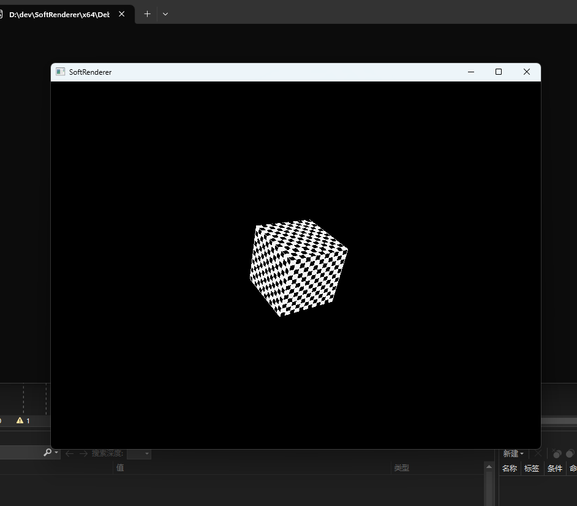
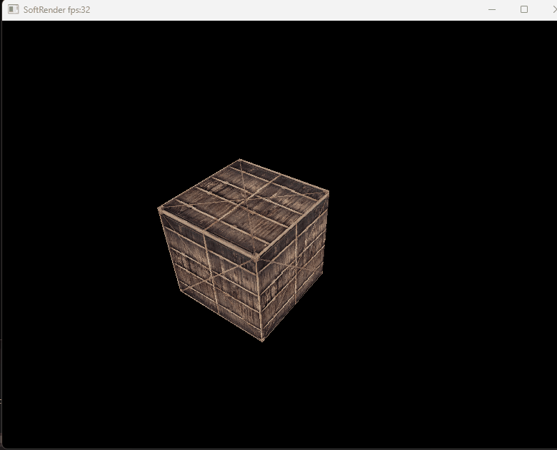

# SoftRenderer

简单的软渲染器，使用C++和OpenGL的glDrawPixels函数实现，所有像素以RGBA形式存入FrameBuffer类再经glDrawPixels函数绘制，支持三维网格的渲染，深度缓冲，加载纹理，纹理的透视映射及背面剔除

加载纹理：

摄像机：

参考资料：

[一篇搞定！GAMES101现代计算机图形学入门（全） - 知乎 (zhihu.com)](https://zhuanlan.zhihu.com/p/394932478)

[从零开始的软渲染器(1) - Hello,三角形 - 知乎 (zhihu.com)](https://zhuanlan.zhihu.com/p/95621444)

